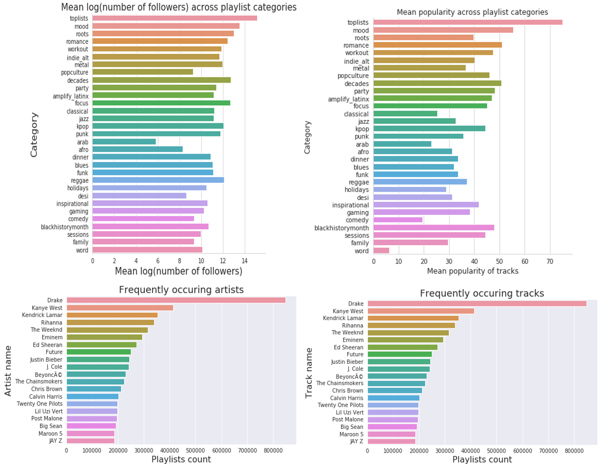

We wanted to get a sense of the common attributes of the playlists in the dataset. To investigate this, we decided to analyze playlist titles and noted that the most common keywords were ‘country’ and ‘chill’ while playlist titles such as ‘new’, ‘disney’, ‘throwback music’, and ‘sleep’ occurred with a distinctly lower frequency.

<p align="center"></p>

Other playlist level attributes we explored were the most popular songs and artists across playlists (plots in the Appendix). At this point, we had a fairly good grasp of the kind of songs, artists, and playlists that are the most common in this dataset, so we moved on to exploring inter-variable relationships.

We started off by making a Seaborn pairplot to visualize the relationships between all the playlist level variables (see Appendix for plot). The main variable of note (and a potential response variable) is the number of followers of a playlist. In our EDA, we specifically wanted to get a better idea of what attributes garner followers for a given playlist. We first tested the assumption that wider availability of a playlist’s songs would translate to higher followers but on visual inspection, the relationship doesn’t seem to be strongly significant. 

<p align="center"></p>

We then tested the hypothesis that playlists comprising of popular songs will have a higher number of followers. Plotting the mean popularity of a playlist’s tracks against its number of followers exhibited a positive correlation upon visual inspection.

<p align="center"></p>

We noted that the follower count of a playlist was very strongly influenced by whether the playlist was featured by Spotify or not and we thus proceeded to visually verify this observation. 

<p align="center"></p>

Lastly, we wanted to see a breakdown of popularity and follower count across the different playlist categories and visual inspections of such are presented below. 

With regard to other datasets, we found that only around 65% of lyrics data information is accessible via free APIs/scraping of free websites. That is due to three primary reasons: 1) many songs not actually having any lyrics, 2) them being in a non-English language, or 3) lyrics not existing on free sources. Nonetheless, the songs that do have lyrics have a relatively unsurprising distribution of most frequent song terms dominated by the most frequent English words (a, the, I, etc.) and a few generic lyric terms (e.g. love).

<p align="center"></p>

Additional EDA we completed to investigate patterns across categories are as follows: 

<p align="center"></p>
<br>

## Code

```python
import pickle
import matplotlib.pyplot as plt
import seaborn as sns 

import numpy as np
import pandas as pd

%matplotlib inline 
```


```python
# ascribe filenames 
playlist_data = 'spot/playlist_level_data_20171203.p'
playlist_to_track_data = 'spot/playlist_to_track_20171203.p'
song_audio_data = 'spot/song_level_data_audio_20171203.p'
song_pop_data = 'spot/song_level_data_pop_20171203.p'
```


```python
# pandas dataframe
pl_df = pickle.load(open(playlist_data, "rb"))

# dict
pl_to_track = pickle.load(open(playlist_to_track_data, "rb"))

# pandas dataframe
song_audio_df = pickle.load(open(song_audio_data, "rb"))

# pandas dataframe
song_pop_df = pickle.load(open(song_pop_data, "rb"))
```


```python
# convert all columns except 'category' to numeric data type
def fun(df, lst):
    for l in lst:
        if l == 'category':
            df[l] = df[l].astype(str)
        else:
            df[l] = pd.to_numeric(df[l])
    return df 

pl_df = fun(pl_df, list(pl_df.columns))
```


```python
# add a column of num_followers on the log scale
pl_df['log_num_followers'] = np.log(pl_df['num_followers'])
```


```python
# peek at the data 
pl_df.head()
```


<div>
<style>
    .dataframe thead tr:only-child th {
        text-align: right;
    }

    .dataframe thead th {
        text-align: left;
    }

    .dataframe tbody tr th {
        vertical-align: top;
    }
</style>
<table border="1" class="dataframe">
  <thead>
    <tr style="text-align: right;">
      <th></th>
      <th>acousticness</th>
      <th>available_markets</th>
      <th>category</th>
      <th>...</th>
    </tr>
  </thead>
  <tbody>
    <tr>
      <th>37i9dQZF1DXcBWIGoYBM5M</th>
      <td>0.217346</td>
      <td>70.200000</td>
      <td>toplists</td>
      <td>...</td>
    </tr>
    <tr>
      <th>37i9dQZF1DX0XUsuxWHRQd</th>
      <td>0.139279</td>
      <td>70.200000</td>
      <td>toplists</td>
      <td>...</td>
    </tr>
    <tr>
      <th>37i9dQZF1DXcF6B6QPhFDv</th>
      <td>0.030224</td>
      <td>57.720000</td>
      <td>toplists</td>
      <td>...</td>
    </tr>
    <tr>
      <th>37i9dQZF1DX4dyzvuaRJ0n</th>
      <td>0.080353</td>
      <td>70.200000</td>
      <td>toplists</td>
      <td>...</td>
    </tr>
    <tr>
      <th>37i9dQZF1DX1lVhptIYRda</th>
      <td>0.205653</td>
      <td>60.339623</td>
      <td>toplists</td>
      <td>...</td>
    </tr>
  </tbody>
</table>
</div>


```python
# helper plotting function 
def fun1(col_name):
    plt.figure(figsize=(10,6))
    sns.regplot(pl_df[col_name], pl_df.log_num_followers)
    plt.xlabel(col_name)
    plt.ylabel('number of followers (log scale)')
    out_name = '{}.png'.format(col_name) 
    plt.savefig(out_name)
```


```python
# Plot each variable's relationship with the number of followers
# basically a pairplot
for col in pl_df.columns:
    if col != 'category':
        fun1(col)
```


```python
# checking the disparity in total number of followers 
# for featured vs. non-featured playlists 

mean_followers_featured = np.mean(pl_df[pl_df['featured'] == 1.0]['num_followers'])
mean_followers_nonfeatured = np.mean(pl_df[pl_df['featured'] == 0.0]['num_followers'])
x = ['Featured', 'Non-featured']
y = [mean_followers_featured, mean_followers_nonfeatured]

with sns.axes_style('whitegrid'):
    size=10
    plt.figure(figsize=(3,4))
    sns.barplot(x=x, y=y)
    plt.xlabel('Playlist status', size=size)
    plt.ylabel('Mean follower count', size=size)
    plt.title('Mean follower counts for featured vs. non-featured playlists', size=size)
    sns.despine();
```


```python
# plotting relationship between mean number of available markets and number of followers
# relationship doesn't seem to be signficant 

with sns.axes_style('whitegrid'):
    size=16
    plt.figure(figsize=(16,8))
    sns.scatterplot(pl_df.available_markets, pl_df.log_num_followers, color='g', alpha=0.6)
    plt.xlabel('Mean available markets', size=size)
    plt.ylabel('Followers count (Log scale)', size=size)
    plt.title('Playlist songs\' mean market availability vs Playlist\'s follower count', size=size+5)
    sns.despine();
```


```python
# plotting relationship between mean popularity of a playlists' songs and
# its number of followers. 
# note that 95% Confidence Intervals are shown 

# mean popularity of a playlist song's seems to be positively correlated 
# with the number of followers. This also makes intuitive sense

with sns.axes_style('whitegrid'):
    plt.figure(figsize=(16,10))
    size=16
    sns.regplot(x='popularity', y='log_num_followers', data=pl_df, ci=95)
    plt.xlabel('Mean popularity score of playlist\'s tracks', size=size)
    plt.ylabel('Playlist\'s follower count (log scale)', size=size)
    plt.title('Relationship between popularity of playlist\'s songs and its follower count', size=size+5)
    sns.despine()
    plt.figure(figsize=(16,10))
    sns.residplot(x='popularity', y='log_num_followers', data=pl_df, color='r')
    plt.title('Residual plot of regression above', size=size+5)
    plt.xlabel('Mean popularity score of playlist\'s tracks', size=size)
    plt.ylabel('Error', size=size);
```


```python
# plot the mean number of followers across different categories
# note that number of followers is on the log scale since some categories
# such as toplists have disproportionately large number of followers

categories = list(pl_df.category.unique())
temp = []
for category in categories:
    temp.append(pl_df[pl_df['category'] == category]['log_num_followers'].mean())
```


```python
with sns.axes_style('whitegrid'):
    size=16
    plt.figure(figsize=(6,7))
    sns.barplot(x=temp, y=categories)
    plt.xlabel('Mean number of followers', size=size)
    plt.ylabel('Category', size=size)
    plt.title('Mean number of followers across playlist categories', size=size)
    sns.despine();
```


```python
# plot the mean popularity across different categories

categories1 = list(pl_df.category.unique())
temp1 = []
for category in categories1:
    temp1.append(pl_df[pl_df['category'] == category]['popularity'].mean())
    
with sns.axes_style('whitegrid'):
    size=12
    plt.figure(figsize=(6,7))
    sns.barplot(x=temp1, y=categories1)
    plt.xlabel('Mean popularity of tracks', size=size)
    plt.ylabel('Category', size=size)
    plt.title('Mean popularity across playlist categories', size=size)
    sns.despine();
```


```python
# pairplotting all variables as a sanity check to see if we missed some obvious patterns
sns.pairplot(pl_df);
```

    IOPub data rate exceeded.
    The notebook server will temporarily stop sending output
    to the client in order to avoid crashing it.
    To change this limit, set the config variable
    `--NotebookApp.iopub_data_rate_limit`.
    

#### Lyrics wikia data


```python
import spotipy
from spotipy.oauth2 import SpotifyClientCredentials
ccm = SpotifyClientCredentials("X", "Y")
sp = spotipy.Spotify(client_credentials_manager=ccm)
```


```python
# pack songs into packs of 50 for faster API queries
song_packs = []
for i in range(0,len(songs),50):
    if i+50 < len(songs):
        song_packs.append(songs["id"][i:i+50])
    else:
        song_packs.append(songs["id"][i:])
```


```python
# find all song titles and artist names
import time
all_songs = []
for pack in song_packs:
    response = sp.tracks(pack)["tracks"]
    for song in response:
        track, artist = song["name"], song["artists"][0]["name"]
#         print(track,artist)
        all_songs.append([track,artist])
    time.sleep(0.10) 
```


```python
to_save = pd.DataFrame(all_songs, columns=["song","artist"])
to_save.to_csv("titles_artists.csv", sep="|")
```


```python
to_save = to_save[to_save.song != ""]
```


```python
to_save["songl"] = to_save.song.map(lambda x: re.search("[^;()-]+", x).group())
to_save.songl = to_save.songl.str.lower().str.rstrip()
to_save["artistl"] = to_save.artist.map(lambda x: re.search("[^;()-]+", x).group())
to_save.artistl = to_save.artistl.str.lower().str.rstrip()
```


```python
# https://pypi.org/project/lyricwikia/
import lyricwikia
def f(row):
    try:
        l = lyricwikia.get_lyrics(row.artistl, row.songl).replace("\n\n","\n")
    except:
        l = "nolyr"
    return l

# to_save.apply(lambda x: lyricwikia.get_lyrics(x.artistl, x.songl).replace("\n\n","\n"), axis=1)
to_save.apply(f, axis=1)
```


