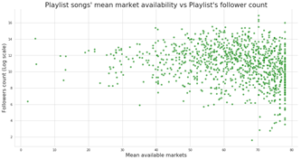
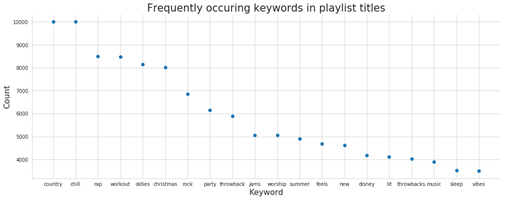
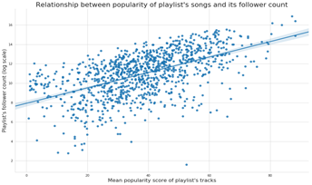
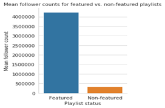
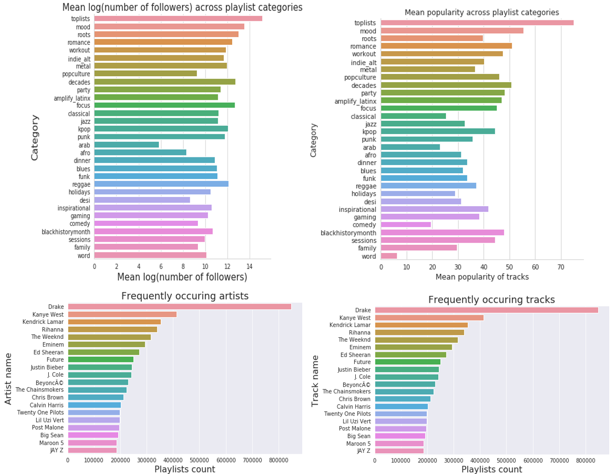

# Motivation & Exploration

## Motivation
Beyond the broader motivations for this area of study previous discussed in the overview, we formulated our approach based on our exploratory data analysis, our own experience using and testing Spotify’s platform, and the literature review described later on. 

In particular, we found that popularity was, as expected, a powerful song and playlist attribute measure and utilized it when evaluating the caliber of existing songs and playlists. Moreover, we noted that playlists are the sum of the songs within as well as synergies between these songs (rather than purely the sum of the parts). Of course, negative synergies are possible and something to be mindful of in evaluation and construction. Lastly, through our EDA, we better understand the core attributes of songs and playlists and were more informed on additional variables we could construct from the given data to measure things like sentiment and be able to enrich the data informing our model development. 

## Description of Data

Our main source of data is the Spotify API; our secondary data source was the Million Playlists Data. We explored other possible datasets, including the Last.fm (as discussed in Milestone 2) but found these to be insufficient in their scope and depth of coverage to fully capture the connections and details needed for an accurate and effective playlist generation model.   

The primary units of analysis in the data are playlists and tracks with the multiple tracks making up each playlist. Each playlist and track have descriptive attributes with which they are associated - these attributes are multi-faceted in their descriptive capabilities, underscoring, for example, the danceability, duration, energy, acousticness, loudiness, speechiness, liveness, key, etc. Furthermore, information on categories are associated with each playlist and track. Possible categories (can be thought of as something akin to “genre”) include pop, rock, indie/alternative, classical, jazz, punk, funk, world, family, toplist, etc. Each playlist and track is identified by a unique ID. Playlists can be matched to its member tracks. Additional functions can be utilized on the data to extract information on the engagement with these playlists and tracks, such as the getting details on the number of followers, the primary markets where the songs are available, and whether the song was featured or not. The majority of data, at the unit level, is either numeric or string; through proper extraction from arrays and dictionaries, the data has not been difficult to work with from the perspective of type compatibility.  

For initial explorations, we examined different visualizations and preliminary analyses of the most popular artists, tracks, and keywords. We created distribution plots to understand popularity and number of follower trends across playlists at the aggregate level. We also sought to better understand how different characteristics (such as degree of acousticness, valence, speechiness, tempo, etc.) of tracks or playlists mapped to popularity score and number of followers (as well as these two measures related to each other - indicating an overall positive relationship, as expected) to better understand how different types of songs appealed to people at the aggregate level. Further details on the results of our initial explorations are included below in the visualizations and findings section.

With regards to data cleaning,  we removed non existent playlists and track IDs ad removed the following track audio-features in a second version of our data set (analysis_url, track_href, uri, and type) as these are not relevant to our future model and broader goal of song discovery. We also removed duplicate columns. For data reconciliation, we compared the data saved in the file and the data before file saving (parameters) to ensure that the two are the same (to ensure the accuracy and preserve the integrity of the data before late use). 

## Exploratory data analysis

We wanted to get a sense of the common attributes of the playlists in the dataset. To investigate this, we decided to analyze playlist titles and noted that the most common keywords were ‘country’ and ‘chill’ while playlist titles such as ‘new’, ‘disney’, ‘throwback music’, and ‘sleep’ occurred with a distinctly lower frequency.

Other playlist level attributes we explored were the most popular songs and artists across playlists (plots in the Appendix). At this point, we had a fairly good grasp of the kind of songs, artists, and playlists that are the most common in this dataset, so we moved on to exploring inter-variable relationships.

We started off by making a Seaborn pairplot to visualize the relationships between all the playlist level variables (see Appendix for plot). The main variable of note (and a potential response variable) is the number of followers of a playlist. In our EDA, we specifically wanted to get a better idea of what attributes garner followers for a given playlist. We first tested the assumption that wider availability of a playlist’s songs would translate to higher followers but on visual inspection, the relationship doesn’t seem to be strongly significant. 

We then tested the hypothesis that playlists comprising of popular songs will have a higher number of followers. Plotting the mean popularity of a playlist’s tracks against its number of followers exhibited a positive correlation upon visual inspection.

We noted that the follower count of a playlist was very strongly influenced by whether the playlist was featured by Spotify or not and we thus proceeded to visually verify this observation. 

Lastly, we wanted to see a breakdown of popularity and follower count across the different playlist categories and visual inspections of such are presented below. 

With regard to other datasets, we found that only around 65% of lyrics data information is accessible via free APIs/scraping of free websites. That is due to three primary reasons: 1) many songs not actually having any lyrics, 2) them being in a non-English language, or 3) lyrics not existing on free sources. Nonetheless, the songs that do have lyrics have a relatively unsurprising distribution of most frequent song terms dominated by the most frequent English words (a, the, I, etc.) and a few generic lyric terms (e.g. love).

Additional EDA we completed to investigate patterns across categories are as follows: 

## Literature Review

_He, Xiangnan; Liao, Lizi; Zhang, Hanwang; Nie, Liqiang; Hu, Xia; Chua, Tat-Seng. “Neural Collaborative Filtering.” National University of Singapore Press, 2018._ [Link to the paper.](https://www.comp.nus.edu.sg/~xiangnan/papers/ncf.pdf)

Neural Collaborative Filtering (NCF) is a novel approach with the capabilities of deep learning applied to recommender systems design through collaborative filtering, the core interaction between users and items. NCF, unlike existing solutions, are able to generalize matrix factorization through replacing the inner product of the model with neural architecture. The paper finds that deeper layers of neural networks provide superior recommendation capabilities, and the overall NCF performs better than existing solutions. This paper informed our model construction, particularly since we first explored a neural network approach, as we discussed in our Milestone 3 submission, and subsequently a collaborative filtering approach so a synergistic combination of the 2 methods in a novel manner was incredibly useful. 
 

_Zamani, Hamed; Schedl, Markus; Lamere, Paul; Chen, Ching-Wei. “An Analysis of Approaches Taken in ACM RecSys Challenge 2018 for Automatic Music Playlist Continuation.”_ [Link to the paper.](https://arxiv.org/abs/1810.01520) 

This paper analyzes the approaches and results of general performers and top performers in the RecSys Challenge. They find that matrix factorization, neighborhood based collaborative filtering models, and rank models were most commonly used across the board. They also find that models work best when enough tracks per a playlist are provided and are randomly selected, rather than sequentially selected. Interestingly, no submissions attempted to infer user intention, which stands in contrast to our original motivation mentioned earlier. The true differentiating results between models arises when many tracks per a playlist are used - when only a few tracks per a playlist are given, many models perform very similarly. Most submissions utilized the features directly given in the Spotify API; only a few teams attempted to formulate their own new data values from the raw audio directly. It is also interesting to note that in general, more information did not lead to superior recommendation capabilities - rather, it appears that more information restricted the generalizability of models and on net balanced out the potential added benefit of having additional data. 

Here, a [similar study](https://github.com/mrthlinh/Spotify-Playlist-Recommender?fbclid=IwAR04ojCadzSdXXXmzlhJMeWokPE8w3y8DBzz0mcMPfpfoFDfU3pqPhCpSVA) was completed to construct continuations of existing playlists given a set of features of the existing playlist. Most relevantly, the project utilized interesting metrics that we considered for our model design and evaluation. Specifically, they utilized the metric of R-precision - the number of retrieved relevant tracks divided by the number of known relevant tracks; they also utilized the normalized discounted cumulative gain from the R-precision - the ranking quality of the recommended tracks, increased where relevant tracks are placed relatively higher on the list. Their proposed solutions were similar to our initial design, focused on KNN, collaborative filtering, and matrix factorization as well as frequent pattern growth. The authors find that playlist based and song based KNN perform well on the dataset. Collaborative filtering achieves a similar result but is generally less efficient to implement.
 

_O’Bryant, Jacob. “A survey of music recommendation and possible improvements.” April 2017_. [Link to the paper.](https://pdfs.semanticscholar.org/7442/c1ebd6c9ceafa8979f683c5b1584d659b728.pdf)

This paper is a meta analysis of existing literature on music recommendations (not solely Spotify). In particular, they study collaborative and content based filtering and propose (without significant implementation) a combined approach that uses user skipping behavior to drive the model learning, balancing exploration and exploitation in generating the optimal listening experience for the user. While the exact practicalities of the design proposed are not made entirely clear and while the constraints of our data (for example, not having information historically or in real time data on user skipping behavior) limited our ability to construct or implement this model exactly, we did find it useful to get a survey of the landscape and different approaches, finding collaborative filtering to be the best fit for our data and interests. 
