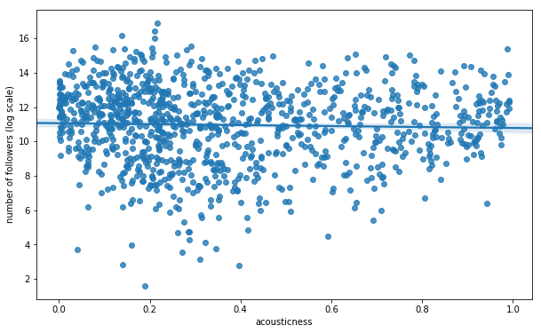
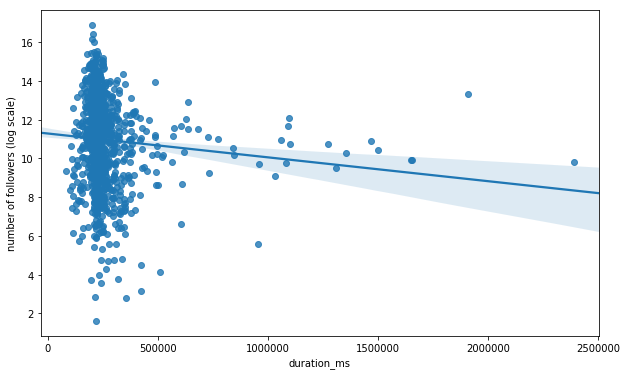
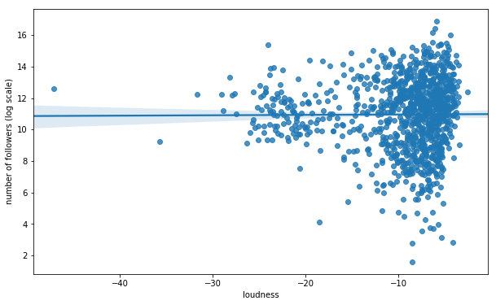
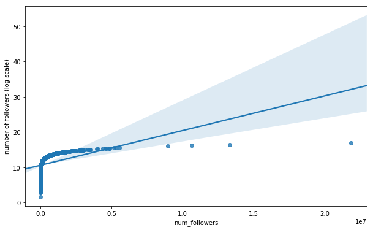
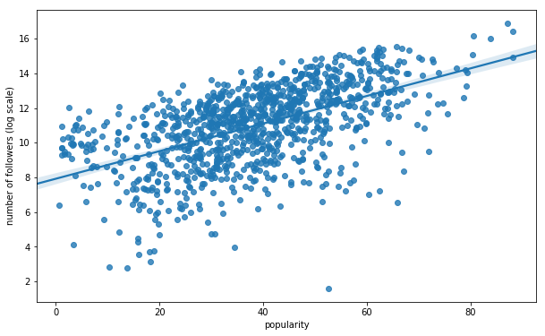
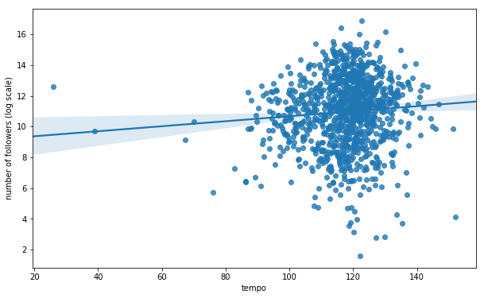
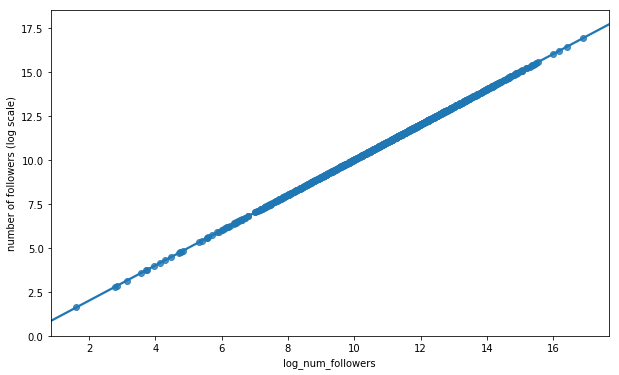
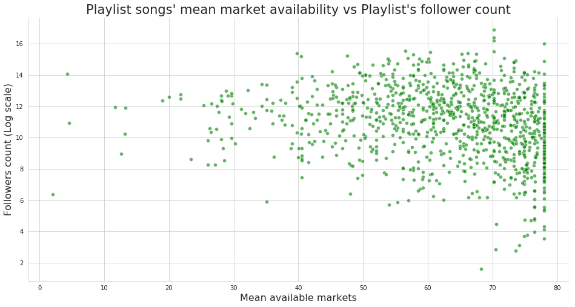

## Motivation
Beyond the broader motivations for this area of study previous discussed in the overview, we formulated our approach based on our exploratory data analysis, our own experience using and testing Spotify’s platform, and the literature review described later on. 

In particular, we found that popularity was, as expected, a powerful song and playlist attribute measure and utilized it when evaluating the caliber of existing songs and playlists. Moreover, we noted that playlists are the sum of the songs within as well as synergies between these songs (rather than purely the sum of the parts). Of course, negative synergies are possible and something to be mindful of in evaluation and construction. Lastly, through our EDA, we better understand the core attributes of songs and playlists and were more informed on additional variables we could construct from the given data to measure things like sentiment and be able to enrich the data informing our model development. 
<br>

## Description of Data

Our main source of data is the Spotify API; our secondary data source was the Million Playlists Data. We explored other possible datasets, including the Last.fm (as discussed in Milestone 2) but found these to be insufficient in their scope and depth of coverage to fully capture the connections and details needed for an accurate and effective playlist generation model.   

The primary units of analysis in the data are playlists and tracks with the multiple tracks making up each playlist. Each playlist and track have descriptive attributes with which they are associated - these attributes are multi-faceted in their descriptive capabilities, underscoring, for example, the danceability, duration, energy, acousticness, loudiness, speechiness, liveness, key, etc. Furthermore, information on categories are associated with each playlist and track. Possible categories (can be thought of as something akin to “genre”) include pop, rock, indie/alternative, classical, jazz, punk, funk, world, family, toplist, etc. Each playlist and track is identified by a unique ID. Playlists can be matched to its member tracks. Additional functions can be utilized on the data to extract information on the engagement with these playlists and tracks, such as the getting details on the number of followers, the primary markets where the songs are available, and whether the song was featured or not. The majority of data, at the unit level, is either numeric or string; through proper extraction from arrays and dictionaries, the data has not been difficult to work with from the perspective of type compatibility.  

For initial explorations, we examined different visualizations and preliminary analyses of the most popular artists, tracks, and keywords. We created distribution plots to understand popularity and number of follower trends across playlists at the aggregate level. We also sought to better understand how different characteristics (such as degree of acousticness, valence, speechiness, tempo, etc.) of tracks or playlists mapped to popularity score and number of followers (as well as these two measures related to each other - indicating an overall positive relationship, as expected) to better understand how different types of songs appealed to people at the aggregate level. Further details on the results of our initial explorations are included below in the visualizations and findings section.

With regards to data cleaning,  we removed non existent playlists and track IDs ad removed the following track audio-features in a second version of our data set (analysis_url, track_href, uri, and type) as these are not relevant to our future model and broader goal of song discovery. We also removed duplicate columns. For data reconciliation, we compared the data saved in the file and the data before file saving (parameters) to ensure that the two are the same (to ensure the accuracy and preserve the integrity of the data before late use). 
<br>

## Exploratory data analysis

We wanted to get a sense of the common attributes of the playlists in the dataset. To investigate this, we decided to analyze playlist titles and noted that the most common keywords were ‘country’ and ‘chill’ while playlist titles such as ‘new’, ‘disney’, ‘throwback music’, and ‘sleep’ occurred with a distinctly lower frequency.

<p align="center"></p>

Other playlist level attributes we explored were the most popular songs and artists across playlists (plots in the Appendix). At this point, we had a fairly good grasp of the kind of songs, artists, and playlists that are the most common in this dataset, so we moved on to exploring inter-variable relationships.

We started off by making a Seaborn pairplot to visualize the relationships between all the playlist level variables (see Appendix for plot). The main variable of note (and a potential response variable) is the number of followers of a playlist. In our EDA, we specifically wanted to get a better idea of what attributes garner followers for a given playlist. We first tested the assumption that wider availability of a playlist’s songs would translate to higher followers but on visual inspection, the relationship doesn’t seem to be strongly significant. 

<p align="center"></p>

We then tested the hypothesis that playlists comprising of popular songs will have a higher number of followers. Plotting the mean popularity of a playlist’s tracks against its number of followers exhibited a positive correlation upon visual inspection.

<p align="center"></p>

We noted that the follower count of a playlist was very strongly influenced by whether the playlist was featured by Spotify or not and we thus proceeded to visually verify this observation. 

<p align="center"></p>

Lastly, we wanted to see a breakdown of popularity and follower count across the different playlist categories and visual inspections of such are presented below. 

With regard to other datasets, we found that only around 65% of lyrics data information is accessible via free APIs/scraping of free websites. That is due to three primary reasons: 1) many songs not actually having any lyrics, 2) them being in a non-English language, or 3) lyrics not existing on free sources. Nonetheless, the songs that do have lyrics have a relatively unsurprising distribution of most frequent song terms dominated by the most frequent English words (a, the, I, etc.) and a few generic lyric terms (e.g. love).

<p align="center"></p>

Additional EDA we completed to investigate patterns across categories are as follows: 

<p align="center"></p>
<br>

## Literature Review

_He, Xiangnan; Liao, Lizi; Zhang, Hanwang; Nie, Liqiang; Hu, Xia; Chua, Tat-Seng. “Neural Collaborative Filtering.” National University of Singapore Press, 2018._ [Link to the paper.](https://www.comp.nus.edu.sg/~xiangnan/papers/ncf.pdf)

Neural Collaborative Filtering (NCF) is a novel approach with the capabilities of deep learning applied to recommender systems design through collaborative filtering, the core interaction between users and items. NCF, unlike existing solutions, are able to generalize matrix factorization through replacing the inner product of the model with neural architecture. The paper finds that deeper layers of neural networks provide superior recommendation capabilities, and the overall NCF performs better than existing solutions. This paper informed our model construction, particularly since we first explored a neural network approach, as we discussed in our Milestone 3 submission, and subsequently a collaborative filtering approach so a synergistic combination of the 2 methods in a novel manner was incredibly useful. 
<br>

_Zamani, Hamed; Schedl, Markus; Lamere, Paul; Chen, Ching-Wei. “An Analysis of Approaches Taken in ACM RecSys Challenge 2018 for Automatic Music Playlist Continuation.”_ [Link to the paper.](https://arxiv.org/abs/1810.01520) 

This paper analyzes the approaches and results of general performers and top performers in the RecSys Challenge. They find that matrix factorization, neighborhood based collaborative filtering models, and rank models were most commonly used across the board. They also find that models work best when enough tracks per a playlist are provided and are randomly selected, rather than sequentially selected. Interestingly, no submissions attempted to infer user intention, which stands in contrast to our original motivation mentioned earlier. The true differentiating results between models arises when many tracks per a playlist are used - when only a few tracks per a playlist are given, many models perform very similarly. Most submissions utilized the features directly given in the Spotify API; only a few teams attempted to formulate their own new data values from the raw audio directly. It is also interesting to note that in general, more information did not lead to superior recommendation capabilities - rather, it appears that more information restricted the generalizability of models and on net balanced out the potential added benefit of having additional data. 

Here, a [similar study](https://github.com/mrthlinh/Spotify-Playlist-Recommender?fbclid=IwAR04ojCadzSdXXXmzlhJMeWokPE8w3y8DBzz0mcMPfpfoFDfU3pqPhCpSVA) was completed to construct continuations of existing playlists given a set of features of the existing playlist. Most relevantly, the project utilized interesting metrics that we considered for our model design and evaluation. Specifically, they utilized the metric of R-precision - the number of retrieved relevant tracks divided by the number of known relevant tracks; they also utilized the normalized discounted cumulative gain from the R-precision - the ranking quality of the recommended tracks, increased where relevant tracks are placed relatively higher on the list. Their proposed solutions were similar to our initial design, focused on KNN, collaborative filtering, and matrix factorization as well as frequent pattern growth. The authors find that playlist based and song based KNN perform well on the dataset. Collaborative filtering achieves a similar result but is generally less efficient to implement.
<br>

_O’Bryant, Jacob. “A survey of music recommendation and possible improvements.” April 2017_. [Link to the paper.](https://pdfs.semanticscholar.org/7442/c1ebd6c9ceafa8979f683c5b1584d659b728.pdf)

This paper is a meta analysis of existing literature on music recommendations (not solely Spotify). In particular, they study collaborative and content based filtering and propose (without significant implementation) a combined approach that uses user skipping behavior to drive the model learning, balancing exploration and exploitation in generating the optimal listening experience for the user. While the exact practicalities of the design proposed are not made entirely clear and while the constraints of our data (for example, not having information historically or in real time data on user skipping behavior) limited our ability to construct or implement this model exactly, we did find it useful to get a survey of the landscape and different approaches, finding collaborative filtering to be the best fit for our data and interests. 

<br>

## Code

#### Million Playlist Dataset retrieval

#### Spotify API data retrieval

#### EDA

```python
import pickle
import matplotlib.pyplot as plt
import seaborn as sns 

import numpy as np
import pandas as pd

%matplotlib inline 
```


```python
# ascribe filenames 
playlist_data = 'spot/playlist_level_data_20171203.p'
playlist_to_track_data = 'spot/playlist_to_track_20171203.p'
song_audio_data = 'spot/song_level_data_audio_20171203.p'
song_pop_data = 'spot/song_level_data_pop_20171203.p'
```


```python
# pandas dataframe
pl_df = pickle.load(open(playlist_data, "rb"))

# dict
pl_to_track = pickle.load(open(playlist_to_track_data, "rb"))

# pandas dataframe
song_audio_df = pickle.load(open(song_audio_data, "rb"))

# pandas dataframe
song_pop_df = pickle.load(open(song_pop_data, "rb"))
```


```python
# convert all columns except 'category' to numeric data type
def fun(df, lst):
    for l in lst:
        if l == 'category':
            df[l] = df[l].astype(str)
        else:
            df[l] = pd.to_numeric(df[l])
    return df 

pl_df = fun(pl_df, list(pl_df.columns))
```


```python
# add a column of num_followers on the log scale
pl_df['log_num_followers'] = np.log(pl_df['num_followers'])
```


```python
# peek at the data 
pl_df.head()
```


<div>
<style>
    .dataframe thead tr:only-child th {
        text-align: right;
    }

    .dataframe thead th {
        text-align: left;
    }

    .dataframe tbody tr th {
        vertical-align: top;
    }
</style>
<table border="1" class="dataframe">
  <thead>
    <tr style="text-align: right;">
      <th></th>
      <th>acousticness</th>
      <th>available_markets</th>
      <th>category</th>
      <th>...</th>
    </tr>
  </thead>
  <tbody>
    <tr>
      <th>37i9dQZF1DXcBWIGoYBM5M</th>
      <td>0.217346</td>
      <td>70.200000</td>
      <td>toplists</td>
      <td>...</td>
    </tr>
    <tr>
      <th>37i9dQZF1DX0XUsuxWHRQd</th>
      <td>0.139279</td>
      <td>70.200000</td>
      <td>toplists</td>
      <td>...</td>
    </tr>
    <tr>
      <th>37i9dQZF1DXcF6B6QPhFDv</th>
      <td>0.030224</td>
      <td>57.720000</td>
      <td>toplists</td>
      <td>...</td>
    </tr>
    <tr>
      <th>37i9dQZF1DX4dyzvuaRJ0n</th>
      <td>0.080353</td>
      <td>70.200000</td>
      <td>toplists</td>
      <td>...</td>
    </tr>
    <tr>
      <th>37i9dQZF1DX1lVhptIYRda</th>
      <td>0.205653</td>
      <td>60.339623</td>
      <td>toplists</td>
      <td>...</td>
    </tr>
  </tbody>
</table>
</div>


```python
# helper plotting function 
def fun1(col_name):
    plt.figure(figsize=(10,6))
    sns.regplot(pl_df[col_name], pl_df.log_num_followers)
    plt.xlabel(col_name)
    plt.ylabel('number of followers (log scale)')
    out_name = '{}.png'.format(col_name) 
    plt.savefig(out_name)
```


```python
# Plot each variable's relationship with the number of followers
# basically a pairplot
for col in pl_df.columns:
    if col != 'category':
        fun1(col)
```























```python
# checking the disparity in total number of followers 
# for featured vs. non-featured playlists 

mean_followers_featured = np.mean(pl_df[pl_df['featured'] == 1.0]['num_followers'])
mean_followers_nonfeatured = np.mean(pl_df[pl_df['featured'] == 0.0]['num_followers'])
x = ['Featured', 'Non-featured']
y = [mean_followers_featured, mean_followers_nonfeatured]

with sns.axes_style('whitegrid'):
    size=10
    plt.figure(figsize=(3,4))
    sns.barplot(x=x, y=y)
    plt.xlabel('Playlist status', size=size)
    plt.ylabel('Mean follower count', size=size)
    plt.title('Mean follower counts for featured vs. non-featured playlists', size=size)
    sns.despine();
```


```python
# plotting relationship between mean number of available markets and number of followers
# relationship doesn't seem to be signficant 

with sns.axes_style('whitegrid'):
    size=16
    plt.figure(figsize=(16,8))
    sns.scatterplot(pl_df.available_markets, pl_df.log_num_followers, color='g', alpha=0.6)
    plt.xlabel('Mean available markets', size=size)
    plt.ylabel('Followers count (Log scale)', size=size)
    plt.title('Playlist songs\' mean market availability vs Playlist\'s follower count', size=size+5)
    sns.despine();
```





```python
# plotting relationship between mean popularity of a playlists' songs and
# its number of followers. 
# note that 95% Confidence Intervals are shown 

# mean popularity of a playlist song's seems to be positively correlated 
# with the number of followers. This also makes intuitive sense

with sns.axes_style('whitegrid'):
    plt.figure(figsize=(16,10))
    size=16
    sns.regplot(x='popularity', y='log_num_followers', data=pl_df, ci=95)
    plt.xlabel('Mean popularity score of playlist\'s tracks', size=size)
    plt.ylabel('Playlist\'s follower count (log scale)', size=size)
    plt.title('Relationship between popularity of playlist\'s songs and its follower count', size=size+5)
    sns.despine()
    plt.figure(figsize=(16,10))
    sns.residplot(x='popularity', y='log_num_followers', data=pl_df, color='r')
    plt.title('Residual plot of regression above', size=size+5)
    plt.xlabel('Mean popularity score of playlist\'s tracks', size=size)
    plt.ylabel('Error', size=size);
```


```python
# plot the mean number of followers across different categories
# note that number of followers is on the log scale since some categories
# such as toplists have disproportionately large number of followers

categories = list(pl_df.category.unique())
temp = []
for category in categories:
    temp.append(pl_df[pl_df['category'] == category]['log_num_followers'].mean())
```


```python
with sns.axes_style('whitegrid'):
    size=16
    plt.figure(figsize=(6,7))
    sns.barplot(x=temp, y=categories)
    plt.xlabel('Mean number of followers', size=size)
    plt.ylabel('Category', size=size)
    plt.title('Mean number of followers across playlist categories', size=size)
    sns.despine();
```


```python
# plot the mean popularity across different categories

categories1 = list(pl_df.category.unique())
temp1 = []
for category in categories1:
    temp1.append(pl_df[pl_df['category'] == category]['popularity'].mean())
    
with sns.axes_style('whitegrid'):
    size=12
    plt.figure(figsize=(6,7))
    sns.barplot(x=temp1, y=categories1)
    plt.xlabel('Mean popularity of tracks', size=size)
    plt.ylabel('Category', size=size)
    plt.title('Mean popularity across playlist categories', size=size)
    sns.despine();
```


```python
# pairplotting all variables as a sanity check to see if we missed some obvious patterns
sns.pairplot(pl_df);
```

    IOPub data rate exceeded.
    The notebook server will temporarily stop sending output
    to the client in order to avoid crashing it.
    To change this limit, set the config variable
    `--NotebookApp.iopub_data_rate_limit`.
    

#### Lyrics wikia data


```python
import spotipy
from spotipy.oauth2 import SpotifyClientCredentials
ccm = SpotifyClientCredentials("X", "Y")
sp = spotipy.Spotify(client_credentials_manager=ccm)
```


```python
# pack songs into packs of 50 for faster API queries
song_packs = []
for i in range(0,len(songs),50):
    if i+50 < len(songs):
        song_packs.append(songs["id"][i:i+50])
    else:
        song_packs.append(songs["id"][i:])
```


```python
# find all song titles and artist names
import time
all_songs = []
for pack in song_packs:
    response = sp.tracks(pack)["tracks"]
    for song in response:
        track, artist = song["name"], song["artists"][0]["name"]
#         print(track,artist)
        all_songs.append([track,artist])
    time.sleep(0.10) 
```


```python
to_save = pd.DataFrame(all_songs, columns=["song","artist"])
to_save.to_csv("titles_artists.csv", sep="|")
```


```python
to_save = to_save[to_save.song != ""]
```


```python
to_save["songl"] = to_save.song.map(lambda x: re.search("[^;()-]+", x).group())
to_save.songl = to_save.songl.str.lower().str.rstrip()
to_save["artistl"] = to_save.artist.map(lambda x: re.search("[^;()-]+", x).group())
to_save.artistl = to_save.artistl.str.lower().str.rstrip()
```


```python
# https://pypi.org/project/lyricwikia/
import lyricwikia
def f(row):
    try:
        l = lyricwikia.get_lyrics(row.artistl, row.songl).replace("\n\n","\n")
    except:
        l = "nolyr"
    return l

# to_save.apply(lambda x: lyricwikia.get_lyrics(x.artistl, x.songl).replace("\n\n","\n"), axis=1)
to_save.apply(f, axis=1)
```


