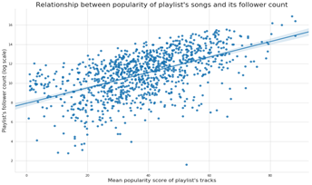

## Overview

Music streaming platforms, such as Spotify, Pandora, and Apple Music have rapidly grown in popularity over recent years, accounting for almost 50% of music consumption globally. Moving forward, these platform and Spotify in particular, with its dominant position and market share, will continue to expand and attract new listeners, transforming the way in which people everywhere interact with music.	
While recommender systems in general have been a popular and crucial area of study and technological development, the application of recommender systems to song discovery in particular has been a uniquely important and challenging endeavor. Unlike movies, online articles, or advertisements, songs are frequently listened to in succession, where the consumer wants little, if any, trouble expending time and energy in manually searching for and selecting a new song every 3-5 minutes for hours at a time. Consequently, recommender systems for music streaming are especially crucial. 

Moreover, music playlist generation is especially impactful - whereas a user may only commit to watching 1 movie on any given day, the duration of music consumption is frequently much more flexible with high caliber playlists extending user engagement during the session in question as well as user engagement with the platform beyond that particular session. This is, in turn, critical for the development of platforms like Spotify, especially as they see inflection points in user growth in the upcoming years and must focus more so than ever on curating high quality playlists and experiences for each user. Automated song discovery will be increasing essential to Spotify’s core operations as the platform further scales globally, relying more so on efficient and high caliber machine led playlist curation. Playlists are the best way to showcase the core product of music streaming platforms and ultimately drive user growth and retention.

## Problem Statement
Through this project, we aim to accomplish the following: 

1. Develop a new understanding of the process of song discovery - the relevant variables, most predictive attributes, most effective grouping mechanisms, and the effectiveness of the same model of different playlist groupings

2. Create a novel method for automated song discovery, generating a playlist for users based on existing song preferences and their characteristics along dimensions, such as emotion, intent, and geography

In particular, we output a list of candidate tracks for the recommended playlist, ordered by relevance in descending order

<iframe src="https://open.spotify.com/embed/playlist/37i9dQZEVXbLRQDuF5jeBp?si=dFydWR8GTEayv3xvnUqtPg" width="300" height="380" frameborder="0" allowtransparency="true"></iframe>

## Motivation
Beyond the broader motivations for this area of study previous discussed in the overview, we formulated our approach based on our exploratory data analysis, our own experience using and testing Spotify’s platform, and the literature review described later on. 

In particular, we found that popularity was, as expected, a powerful song and playlist attribute measure and utilized it when evaluating the caliber of existing songs and playlists. Moreover, we noted that playlists are the sum of the songs within as well as synergies between these songs (rather than purely the sum of the parts). Of course, negative synergies are possible and something to be mindful of in evaluation and construction. Lastly, through our EDA, we better understand the core attributes of songs and playlists and were more informed on additional variables we could construct from the given data to measure things like sentiment and be able to enrich the data informing our model development. 

## Description of Data

Our main source of data is the Spotify API; our secondary data source was the Million Playlists Data. We explored other possible datasets, including the Last.fm (as discussed in Milestone 2) but found these to be insufficient in their scope and depth of coverage to fully capture the connections and details needed for an accurate and effective playlist generation model.   

The primary units of analysis in the data are playlists and tracks with the multiple tracks making up each playlist. Each playlist and track have descriptive attributes with which they are associated - these attributes are multi-faceted in their descriptive capabilities, underscoring, for example, the danceability, duration, energy, acousticness, loudiness, speechiness, liveness, key, etc. Furthermore, information on categories are associated with each playlist and track. Possible categories (can be thought of as something akin to “genre”) include pop, rock, indie/alternative, classical, jazz, punk, funk, world, family, toplist, etc. Each playlist and track is identified by a unique ID. Playlists can be matched to its member tracks. Additional functions can be utilized on the data to extract information on the engagement with these playlists and tracks, such as the getting details on the number of followers, the primary markets where the songs are available, and whether the song was featured or not. The majority of data, at the unit level, is either numeric or string; through proper extraction from arrays and dictionaries, the data has not been difficult to work with from the perspective of type compatibility.  

For initial explorations, we examined different visualizations and preliminary analyses of the most popular artists, tracks, and keywords. We created distribution plots to understand popularity and number of follower trends across playlists at the aggregate level. We also sought to better understand how different characteristics (such as degree of acousticness, valence, speechiness, tempo, etc.) of tracks or playlists mapped to popularity score and number of followers (as well as these two measures related to each other - indicating an overall positive relationship, as expected) to better understand how different types of songs appealed to people at the aggregate level. Further details on the results of our initial explorations are included below in the visualizations and findings section.

With regards to data cleaning,  we removed non existent playlists and track IDs ad removed the following track audio-features in a second version of our data set (analysis_url, track_href, uri, and type) as these are not relevant to our future model and broader goal of song discovery. We also removed duplicate columns. For data reconciliation, we compared the data saved in the file and the data before file saving (parameters) to ensure that the two are the same (to ensure the accuracy and preserve the integrity of the data before late use). 

## Exploratory data analysis

We wanted to get a sense of the common attributes of the playlists in the dataset. To investigate this, we decided to analyze playlist titles and noted that the most common keywords were ‘country’ and ‘chill’ while playlist titles such as ‘new’, ‘disney’, ‘throwback music’, and ‘sleep’ occurred with a distinctly lower frequency.

<p align="center"></p>

Other playlist level attributes we explored were the most popular songs and artists across playlists (plots in the Appendix). At this point, we had a fairly good grasp of the kind of songs, artists, and playlists that are the most common in this dataset, so we moved on to exploring inter-variable relationships.

We started off by making a Seaborn pairplot to visualize the relationships between all the playlist level variables (see Appendix for plot). The main variable of note (and a potential response variable) is the number of followers of a playlist. In our EDA, we specifically wanted to get a better idea of what attributes garner followers for a given playlist. We first tested the assumption that wider availability of a playlist’s songs would translate to higher followers but on visual inspection, the relationship doesn’t seem to be strongly significant. 

<p align="center"></p>

We then tested the hypothesis that playlists comprising of popular songs will have a higher number of followers. Plotting the mean popularity of a playlist’s tracks against its number of followers exhibited a positive correlation upon visual inspection.

<p align="center"></p>

We noted that the follower count of a playlist was very strongly influenced by whether the playlist was featured by Spotify or not and we thus proceeded to visually verify this observation. 

<p align="center"></p>

Lastly, we wanted to see a breakdown of popularity and follower count across the different playlist categories and visual inspections of such are presented below. 

With regard to other datasets, we found that only around 65% of lyrics data information is accessible via free APIs/scraping of free websites. That is due to three primary reasons: 1) many songs not actually having any lyrics, 2) them being in a non-English language, or 3) lyrics not existing on free sources. Nonetheless, the songs that do have lyrics have a relatively unsurprising distribution of most frequent song terms dominated by the most frequent English words (a, the, I, etc.) and a few generic lyric terms (e.g. love).

<p align="center"></p>

Additional EDA we completed to investigate patterns across categories are as follows: 

<p align="center"></p>

## Literature Review

_He, Xiangnan; Liao, Lizi; Zhang, Hanwang; Nie, Liqiang; Hu, Xia; Chua, Tat-Seng. “Neural Collaborative Filtering.” National University of Singapore Press, 2018._ [Link to the paper.](https://www.comp.nus.edu.sg/~xiangnan/papers/ncf.pdf)

Neural Collaborative Filtering (NCF) is a novel approach with the capabilities of deep learning applied to recommender systems design through collaborative filtering, the core interaction between users and items. NCF, unlike existing solutions, are able to generalize matrix factorization through replacing the inner product of the model with neural architecture. The paper finds that deeper layers of neural networks provide superior recommendation capabilities, and the overall NCF performs better than existing solutions. This paper informed our model construction, particularly since we first explored a neural network approach, as we discussed in our Milestone 3 submission, and subsequently a collaborative filtering approach so a synergistic combination of the 2 methods in a novel manner was incredibly useful. 
<br>

_Zamani, Hamed; Schedl, Markus; Lamere, Paul; Chen, Ching-Wei. “An Analysis of Approaches Taken in ACM RecSys Challenge 2018 for Automatic Music Playlist Continuation.”_ [Link to the paper.](https://arxiv.org/abs/1810.01520) 

This paper analyzes the approaches and results of general performers and top performers in the RecSys Challenge. They find that matrix factorization, neighborhood based collaborative filtering models, and rank models were most commonly used across the board. They also find that models work best when enough tracks per a playlist are provided and are randomly selected, rather than sequentially selected. Interestingly, no submissions attempted to infer user intention, which stands in contrast to our original motivation mentioned earlier. The true differentiating results between models arises when many tracks per a playlist are used - when only a few tracks per a playlist are given, many models perform very similarly. Most submissions utilized the features directly given in the Spotify API; only a few teams attempted to formulate their own new data values from the raw audio directly. It is also interesting to note that in general, more information did not lead to superior recommendation capabilities - rather, it appears that more information restricted the generalizability of models and on net balanced out the potential added benefit of having additional data. 

Here, a [similar study](https://github.com/mrthlinh/Spotify-Playlist-Recommender?fbclid=IwAR04ojCadzSdXXXmzlhJMeWokPE8w3y8DBzz0mcMPfpfoFDfU3pqPhCpSVA) was completed to construct continuations of existing playlists given a set of features of the existing playlist. Most relevantly, the project utilized interesting metrics that we considered for our model design and evaluation. Specifically, they utilized the metric of R-precision - the number of retrieved relevant tracks divided by the number of known relevant tracks; they also utilized the normalized discounted cumulative gain from the R-precision - the ranking quality of the recommended tracks, increased where relevant tracks are placed relatively higher on the list. Their proposed solutions were similar to our initial design, focused on KNN, collaborative filtering, and matrix factorization as well as frequent pattern growth. The authors find that playlist based and song based KNN perform well on the dataset. Collaborative filtering achieves a similar result but is generally less efficient to implement.
<br>

_O’Bryant, Jacob. “A survey of music recommendation and possible improvements.” April 2017_. [Link to the paper.](https://pdfs.semanticscholar.org/7442/c1ebd6c9ceafa8979f683c5b1584d659b728.pdf)

This paper is a meta analysis of existing literature on music recommendations (not solely Spotify). In particular, they study collaborative and content based filtering and propose (without significant implementation) a combined approach that uses user skipping behavior to drive the model learning, balancing exploration and exploitation in generating the optimal listening experience for the user. While the exact practicalities of the design proposed are not made entirely clear and while the constraints of our data (for example, not having information historically or in real time data on user skipping behavior) limited our ability to construct or implement this model exactly, we did find it useful to get a survey of the landscape and different approaches, finding collaborative filtering to be the best fit for our data and interests. 

## Modeling Approach

**Collaborative filtering** (per [here](https://www.ethanrosenthal.com/2015/11/02/intro-to-collaborative-filtering/) and [here](http://infolab.stanford.edu/~ullman/mmds/ch9.pdf)) can be used at either playlist or song level. At the playlist level, collaborative filtering essentially finds the similarity between playlists and how other playlists rate a particular track through their decision to include this track from the weighted aggregation of this cross-playlist information. Similarly, at the song level, collaborative filtering finds commonalities between songs and how current playlists rate, per the same definition, other songs, thereby formulating a rating measurement for each song. 

More broadly, the benefits of collaborative filtering include its ability to scale given correlated items (since the fundamental concept of the model is rooted in correlation based similarities between users and items), ease of implementation, and dynamic capabilities in progressively adding more data. The method’s disadvantages are primarily the sparsity problem rating matrices create, arguable over reliance on user ratings, and difficulty in the early stages when limited data on either front is available for use in the model.

In order to implement collaborative filtering, we first build a playlist song matrix indicating through a binary variable whether a song was included in the playlist p. Subsequently, we find the cosine similarity (the most common distance metric used in the literature) between songs and between playlists in the data. Cosine similarity is essentially the “distance” between the user and item in the matrix represented as a vector. We then predict whether a playlist contains a song using the weighted sum of all other playlists that contain this song - the weighting is determined by the cosine similarity between each playlist in the data. A similar approach is taken for songs with the analogous song data.

Improvements on the model can be made through considering only the top k items and/or accounting for individual item biases (such as the varying harshness of user ratings in such a model) and/or accounting for biases toward the naturally more popular songs. 

In our particular model, we adapt the existing work around collaborative filtering as above described to memory based user item and item item collaborative filtering. We then comparatively analyze and evaluate the 2 approaches. 

We also attempted to implement a **matrix factorization** approach; we used the same data as above - the data of which playlists included which songs - and trained our model by minimizing a loss function. This loss function was the mean squared error of the predictions plus regularization terms, and the parameters being optimized over were attribute values for the playlists and corresponding ones for the songs. These attributes were not fixed and were chosen by the model, but if interpreted later, may end up being something like the speed or mood of a song. Unfortunately, when we attempted to implement this, the model did not appear to discover any meaningful attributes and ended up completely overfitting.

These two different approaches use the same data for vastly different methods under different assumptions. This leads to very different outcomes between these approaches. Collaborative filtering only makes one assumption, which is that playlists with significant overlap in songs contained would probably contain other songs which would be a good match for the other playlist. This assumption appears to hold in the case of playlists, as on the small dataset of 2000 playlists with fairly weak pairwise similarity, we already saw significant improvements in the predictions. On the other hand, matrix factorization also assumes that there exists some set of features in the songs which have analogues in the playlists, such that songs and playlists with similar values in these features would be a good match for one another. This assumption turned out to be false, and this can be attributed to the fact that many users probably enjoy lots of different types of music. Making a playlist of one’s favorite songs is certainly a common thing for people to do, and such playlists would probably not have a particularly strong correlation between the content of the songs in the playlist for any particular feature. Accordingly, this model that attempted to find such a correlation in the features had a nearly 100% rate of failure on the test set.

## Results

None of our models were able to accurately predict which songs were in any given playlist. However, we believe that the collaborative filtering approach with a more comprehensive dataset would have been able to do such a thing. When we ran this model on a set of slightly over 300 playlists, 250 of which were labeled “latin,” and 114 of which labeled “classical,” we discovered that despite sharing categories, these playlists still have abysmally low similarities to one another. As a result, we would see at most 2 songs of overlap between playlists, and very few songs not in the truncated playlist were suggested with any significant probability. We did notice that the probabilities for the songs in the test set did tend to be at least 1%, though, which indicated that there was some playlist with nonzero overlap which contained the song.

When we tested this model on a dataset consisting of 2000 playlists pulled from the million playlists dataset, we noticed that the MSE dropped from about 0.95 to about 0.85; that is, for the values in the test set that should have been 1, if the model predicted a song to be in the playlist with probability p, the average of (1-p)^2 dropped from about 0.95 to about 0.85. This was a fairly significant drop, and we believe that if we were to increase the data further so we could have a substantial number of similar playlists to any given playlist, this model would see even greater success. Unfortunately, we did not have the computation power necessary to test this.

We also found that through the Million Playlist Data, there were a number of playlists with just 1 follower (which is quite typical as expected from user experience where we create a playlist just for ourselves or ourselves and one friend, rather than some large group or some organically mass followed playlist). Consequently, the values in our similarity matrix were quite low, which led to the aforementioned results found in evaluation. One possible way to ameliorate this is through taking a top k approach, which would reduce the focus and incorporation of these 1 follower playlists that otherwise confound the data and thereby model inputs and model. More broadly, as we mentioned in our literature review, approaches that account for natural bias of this sort and others through the UI understanding we noted here, are quite valuable in constructing improved models.

## Conclusion and Summary
	
As discussed in the overview and motivation sections, through this project, we aimed to better understand the performance of different models in generating playlists across different types of listeners and music categories. We also aimed to generate a novel method, building on existing work, that generates playlists for automated song discovery. We focused primarily on considerations of accuracy of song discovery and secondarily, considerations around context (including UI inferences - for example, what would users truly care about when evaluating new songs or other recommendation songs?) as well as practical implementation and execution advantages and disadvantages.  

We were inspired to pursue this work by the growth in centralized, platform based music streaming services like Spotify and felt that there was tremendous potential in work on recommender systems in this particular area given the rapid user base growth on music streaming platforms and Spotify in particular as well as the aforementioned uniqueness of song discovery as a challenging but rewarding area of recommender system application.

## Future Work

There are several possible avenues of future studies to build upon our work here. In particular, we can explore: 

1. using a top k approach, as mentioned above, and general accounting for bias to provide better data inputs and likely improve model performance per our aforementioned understanding of the current raw data we have retrieved
2. how the prediction model capabilities across other possible segmentation of song, playlist, and user types
3. the efficacy of content based vs. collaborative filtering approaches
4. the usage of different evaluation metrics in determining the caliber of prediction models
5. incorporating user interaction for more direct user real time feedback in learning based models
6. the effect of inclusion and exclusion of different types of data, such as intention, mood, and geography
7. working with different data sets (such as focusing more on the Million Playlist Data and/or incorporating LyricWiki and the crowdsourced user given tags in the Last.fm data)


### GITHUB

```markdown
```
Syntax highlighted code block

#### Header 1

- Bulleted

1. Numbered

**Bold** and _Italic_ and `Code` text

[Link](url) and 

For more details see [GitHub Flavored Markdown](https://guides.github.com/features/mastering-markdown/).

### Jekyll Themes

Your Pages site will use the layout and styles from the Jekyll theme you have selected in your [repository settings](https://github.com/ALithuanian/alithuanian.github.io/settings). The name of this theme is saved in the Jekyll `_config.yml` configuration file.
