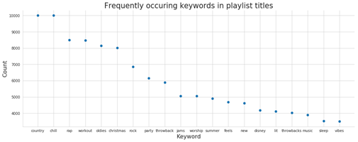

## Overview

Music streaming platforms, such as Spotify, Pandora, and Apple Music have rapidly grown in popularity over recent years, accounting for almost 50% of music consumption globally. Moving forward, these platform and Spotify in particular, with its dominant position and market share, will continue to expand and attract new listeners, transforming the way in which people everywhere interact with music. 
	
While recommender systems in general have been a popular and crucial area of study and technological development, the application of recommender systems to song discovery in particular has been a uniquely important and challenging endeavor. Unlike movies, online articles, or advertisements, songs are frequently listened to in succession, where the consumer wants little, if any, trouble expending time and energy in manually searching for and selecting a new song every 3-5 minutes for hours at a time. Consequently, recommender systems for music streaming are especially crucial. 
  
Moreover, music playlist generation is especially impactful - whereas a user may only commit to watching 1 movie on any given day, the duration of music consumption is frequently much more flexible with high caliber playlists extending user engagement during the session in question as well as user engagement with the platform beyond that particular session. This is, in turn, critical for the development of platforms like Spotify, especially as they see inflection points in user growth in the upcoming years and must focus more so than ever on curating high quality playlists and experiences for each user. Automated song discovery will be increasing essential to Spotify’s core operations as the platform further scales globally, relying more so on efficient and high caliber machine led playlist curation. Playlists are the best way to showcase the core product of music streaming platforms and ultimately drive user growth and retention. 

## Problem Statement
Through this project, we aim to accomplish the following: 

1. Develop a new understanding of the process of song discovery - the relevant variables, most predictive attributes, most effective grouping mechanisms, and the effectiveness of the same model of different playlist groupings  

2. Create a novel method for automated song discovery, generating a playlist for users based on existing song preferences and their characteristics along dimensions, such as emotion, intent, and geography

In particular, we output a list of candidate tracks for the recommended playlist, ordered by relevance in descending order 

## Motivation
Beyond the broader motivations for this area of study previous discussed in the overview, we formulated our approach based on our exploratory data analysis, our own experience using and testing Spotify’s platform, and the literature review described later on. 

In particular, we found that popularity was, as expected, a powerful song and playlist attribute measure and utilize when evaluating the caliber of existing songs and playlists. Moreover, we noted that playlists are the sum of the songs within as well as synergies between these songs (rather than purely the sum of the parts). Of course, negative synergies are possible and something to be mindful of in evaluation and construction. Lastly, through our EDA, we better understand the core attributes of songs and playlists and were more informed on additional variables we could construct from the given data to measure things like sentiment and be able to enrich the data informing our model development. 

## Description of Data

Our main source of data is the Spotify API. We explored other possible datasets, including the Last.fm, Million Playlist, and LyricWiki (as discussed in our Milestone 2) but found these to be insufficient in their scope and depth of coverage to fully capture the connections and details needed for an accurate and effective playlist generation model.  

The primary units of analysis in the data are playlists and tracks with the multiple tracks making up each playlist. Each playlist and track have descriptive attributes with which they are associated - these attributes are multi-faceted in their descriptive capabilities, underscoring, for example, the danceability, duration, energy, acousticness, loudiness, speechiness, liveness, key, etc. Furthermore, information on categories are associated with each playlist and track. Possible categories (can be thought of as something akin to “genre”) include pop, rock, indie/alternative, classical, jazz, punk, funk, world, family, toplist, etc. Each playlist and track is identified by a unique ID. Playlists can be matched to its member tracks. Additional functions can be utilized on the data to extract information on the engagement with these playlists and tracks, such as the getting details on the number of followers, the primary markets where the songs are available, and whether the song was featured or not. The majority of data, at the unit level, is either numerical or string; through proper extraction from arrays and dictionaries, the data has not been difficult to work with from the perspective of type compatibility. 

For initial explorations, we examined different visualizations and preliminary analyses of the most popular artists, tracks, and keywords. We created distribution plots to understand popularity and number of follower trends across playlists at the aggregate level. We also sought to better understand how different characteristics (such as degree of acouticness, valence, speechiness, tempo, etc.) of tracks or playlists mapped to popularity score and number of followers (as well as these two measures related to each other - indicating an overall positive relationship, as expected) to better understand how different types of songs appealed to people at the aggregate level. Further details on the results of our initial explorations are included below in the visualizations and findings section. 

With regards to data cleaning,  we removed non existent playlists and track IDs ad removed the following track audio-features in a second version of our data set (analysis_url, track_href, uri, and type) as these are not relevant to our future model and broader goal of song discovery. We also removed duplicate columns. For data reconciliation, we compared the data saved in the file and the data before file saving (parameters) to ensure that the two are the same (to ensure the accuracy and preserve the integrity of the data before late use). 

## Exploratory data analysis

We wanted to get a sense of the common attributes of the playlists in the dataset. To investigate this, we decided to analyze playlist titles and noted that the most common keywords were ‘country’ and ‘chill’ while playlist titles such as ‘new’, ‘disney’, ‘throwback music’, and ‘sleep’ occurred with a distinctly lower frequency.

<p align="center"></p>

Other playlist level attributes we explored were the most popular songs and artists across playlists (plots in the Appendix). At this point, we had a fairly good grasp of the kind of songs, artists, and playlists that are the most common in this dataset, so we moved on to exploring inter-variable relationships.

We started off by making a Seaborn pairplot to visualize the relationships between all the playlist level variables (see Appendix for plot). The main variable of note (and a potential response variable) is the number of followers of a playlist. In our EDA, we specifically wanted to get a better idea of what attributes garner followers for a given playlist. We first tested the assumption that wider availability of a playlist’s songs would translate to higher followers but on visual inspection, the relationship doesn’t seem to be strongly significant. 

<p align="center"></p>

We then tested the hypothesis that playlists comprising of popular songs will have a higher number of followers. Plotting the mean popularity of a playlist’s tracks against its number of followers exhibited a positive correlation upon visual inspection.

<p align="center"></p>

We noted that the follower count of a playlist was very strongly influenced by whether the playlist was featured by Spotify or not and we thus proceeded to visually verify this observation. 

<p align="center"></p>

Lastly, we wanted to see a breakdown of popularity and follower count across the different playlist categories and visual inspections of such are presented below. 

With regard to other datasets, we found that only around 65% of lyrics data information is accessible via free APIs/scraping of free websites. That is due to three primary reasons: 1) many songs not actually having any lyrics, 2) them being in a non-English language, or 3) lyrics not existing on free sources. Nonetheless, the songs that do have lyrics have a relatively unsurprising distribution of most frequent song terms dominated by the most frequent English words (a, the, I, etc.) and a few generic lyric terms (e.g. love). 

<p align="center"></p>

Additional EDA we completed to investigate patterns across categories are as follows: 

<p align="center"></p>

### GITHUB

```markdown
```
Syntax highlighted code block

#### Header 1

- Bulleted

1. Numbered

**Bold** and _Italic_ and `Code` text

[Link](url) and 

For more details see [GitHub Flavored Markdown](https://guides.github.com/features/mastering-markdown/).

### Jekyll Themes

Your Pages site will use the layout and styles from the Jekyll theme you have selected in your [repository settings](https://github.com/ALithuanian/alithuanian.github.io/settings). The name of this theme is saved in the Jekyll `_config.yml` configuration file.
