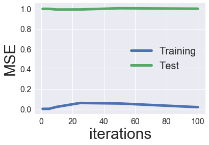

## Collaborative filtering

Collaborative filtering (per [here](https://www.ethanrosenthal.com/2015/11/02/intro-to-collaborative-filtering/) and [here](http://infolab.stanford.edu/~ullman/mmds/ch9.pdf)) can be used at either playlist or song level. At the playlist level, collaborative filtering essentially finds the similarity between playlists and how other playlists rate a particular track through their decision to include this track from the weighted aggregation of this cross-playlist information. Similarly, at the song level, collaborative filtering finds commonalities between songs and how current playlists rate, per the same definition, other songs, thereby formulating a rating measurement for each song. 

More broadly, the benefits of collaborative filtering include its ability to scale given correlated items (since the fundamental concept of the model is rooted in correlation based similarities between users and items), ease of implementation, and dynamic capabilities in progressively adding more data. The method’s disadvantages are primarily the sparsity problem rating matrices create, arguable over reliance on user ratings, and difficulty in the early stages when limited data on either front is available for use in the model.

In order to implement collaborative filtering, we first build a playlist song matrix indicating through a binary variable whether a song was included in the playlist p. Subsequently, we find the cosine similarity (the most common distance metric used in the literature) between songs and between playlists in the data. Cosine similarity is essentially the “distance” between the user and item in the matrix represented as a vector. We then predict whether a playlist contains a song using the weighted sum of all other playlists that contain this song - the weighting is determined by the cosine similarity between each playlist in the data. A similar approach is taken for songs with the analogous song data.

Improvements on the model can be made through considering only the top k items and/or accounting for individual item biases (such as the varying harshness of user ratings in such a model) and/or accounting for biases toward the naturally more popular songs. 

In our particular model, we adapt the existing work around collaborative filtering as above described to memory based user item and item item collaborative filtering. We then comparatively analyze and evaluate the 2 approaches. 
<br>

## Matrix factorization

We also attempted to implement a matrix factorization approach; we used the same data as above - the data of which playlists included which songs - and trained our model by minimizing a loss function. This loss function was the mean squared error of the predictions plus regularization terms, and the parameters being optimized over were attribute values for the playlists and corresponding ones for the songs. These attributes were not fixed and were chosen by the model, but if interpreted later, may end up being something like the speed or mood of a song. Unfortunately, when we attempted to implement this, the model did not appear to discover any meaningful attributes and ended up completely overfitting.

These two different approaches use the same data for vastly different methods under different assumptions. This leads to very different outcomes between these approaches. Collaborative filtering only makes one assumption, which is that playlists with significant overlap in songs contained would probably contain other songs which would be a good match for the other playlist. This assumption appears to hold in the case of playlists, as on the small dataset of 2000 playlists with fairly weak pairwise similarity, we already saw significant improvements in the predictions. On the other hand, matrix factorization also assumes that there exists some set of features in the songs which have analogues in the playlists, such that songs and playlists with similar values in these features would be a good match for one another. This assumption turned out to be false, and this can be attributed to the fact that many users probably enjoy lots of different types of music. Making a playlist of one’s favorite songs is certainly a common thing for people to do, and such playlists would probably not have a particularly strong correlation between the content of the songs in the playlist for any particular feature. Accordingly, this model that attempted to find such a correlation in the features had a nearly 100% rate of failure on the test set.

## Code

#### Collaborative filtering

This is the main code for our Collaborative Filtering approach. Herein we implement both playlist-based and song-based collaborative filtering through the creation of similarity matrices and compare results from the two approaches. Particular thanks to [Ethan Rosenthal](https://www.ethanrosenthal.com/#) for his blog posts on Collaborative Filtering.  

We start by importing the relevant libraries and reading in the data. 


```python
# import relevant libraries  
import numpy as np
import pandas as pd
import matplotlib.pyplot as plt
import pickle
from sklearn.metrics import mean_squared_error
import seaborn as sns
```


```python
# read in the data 
# data retrieval methods present in data_retrieval.ipynb 

# tracks_in_playlists is a dict wherein each key is a playlist id
# and each value is a list of song id's corresponding to songs 
# contained in that playlist  
a = open("tracks_in_playlists2.p",'rb')
tracks_in_playlists = pickle.load(a)

# playlist_data is a dict wherein each key is a playlist id
# and each value is a list of playlist attributes
a = open("playlist_data2.p", 'rb')
playlist_data = pickle.load(a)
```

###### Generating  quality scores for playlists   
Besides similarity scores, we wanted to weigh each playlist in our model according to a custom-generated 'quality' metric. The motivation behind the quality score stemmed from a desire to account for playlists which have a high follower count not as a result of a plurality of good songs but rather by having fewer really popular songs in them. Thus, we divided regularized the number of followers by the mean popularity of the songs contained in the playlist to generate the quality metric. 


```python
# generate quality scores for each playlist   
playlist_quality = dict()
for playlist in playlist_data:
    pop_mean = playlist_data[playlist]["popularity"]
    num_followers = playlist_data[playlist]["num_followers"]
    playlist_quality[playlist] = np.log(num_followers) / pop_mean
```


```python
playlist_quality = np.asarray(list(playlist_quality.values()))
```


```python
# quick sanity check 
len(playlist_quality)
```


    17


```python
# ensuring the two datasets match 
for playlist in list(tracks_in_playlists):
    if playlist not in playlist_data:
        del(tracks_in_playlists[playlist])
print(len(tracks_in_playlists))
```

    17
    


```python
# regularizing playlist quality values 
min_score = np.min(playlist_quality)
max_score = np.max(playlist_quality)
playlist_quality = (playlist_quality-min_score)/(max_score-min_score)
```


```python
num_small = 0
for i in playlist_quality:
    if i < 0.1:
        num_small += 1
print(num_small)
```

    2
    


```python
tracks_in_playlists
all_songs = {}
all_playlists = {}

# for each playlist
for playlist in tracks_in_playlists:
    # for each song in that playlist 
    for song in tracks_in_playlists[playlist]:
        # mark that song present 
        all_songs[song] = 1
    # mark that playlist present 
    all_playlists[playlist] = 1
```


```python
all_songs = list(all_songs)
all_playlists =  list(all_playlists)
num_songs = len(all_songs)
num_playlists = len(all_playlists)

print('In our dataset, we have {0} songs over {1} playlists'.format(num_songs, num_playlists))
```

    In our dataset, we have 1196 songs over 17 playlists
    

###### Generating main dataframe 
We generate a dataframe named `inclusion_df` wherein each row corresponds to a playlist, each column corresponds to a song and a value of `1.0` represents that the song (column-value) is present in that playlist (row-value)  


```python
inclusion_df = pd.DataFrame(np.zeros((num_playlists, num_songs)), index = all_playlists, columns = all_songs)
```


```python
# populate the dataframe 
for playlist in tracks_in_playlists:
    for song in tracks_in_playlists[playlist]:
        inclusion_df[song][playlist] = 1
```


```python
inclusion_df.head()
```


<div>
<style scoped>
    .dataframe tbody tr th:only-of-type {
        vertical-align: middle;
    }

    .dataframe tbody tr th {
        vertical-align: top;
    }

    .dataframe thead th {
        text-align: right;
    }
</style>
<table border="1" class="dataframe">
  <thead>
    <tr style="text-align: right;">
      <th></th>
      <th>spotify:track:14gEDPQtsTcbZOWs7EXg4V</th>
      <th>...</th>
      <th>tN</th>
    </tr>
  </thead>
  <tbody>
    <tr>
      <th>101121</th>
      <td>0.0</td>
      <td>...</td>
      <td>0.0</td>
    </tr>
    <tr>
      <th>720740</th>
      <td>0.0</td>
      <td>...</td>
      <td>1.0</td>
    </tr>
    <tr>
      <th>159077</th>
      <td>0.0</td>
      <td>...</td>
      <td>0.0</td>
    </tr>
    <tr>
      <th>547873</th>
      <td>0.0</td>
      <td>...</td>
      <td>0.0</td>
    </tr>
    <tr>
      <th>25495</th>
      <td>0.0</td>
      <td>...</td>
      <td>0.0</td>
    </tr>
  </tbody>
</table>
<p>5 rows × 1196 columns</p>
</div>


```python
inclusion_df.shape
```


    (17, 1196)


###### Calculating the sparsity of playlist-song matrix 


```python
sparsity = float(len(np.asarray(inclusion_df).nonzero()[0]))
sparsity /= (inclusion_df.shape[0] * inclusion_df.shape[1])
sparsity *= 100
print('Sparsity: {:4.2f}%'.format(sparsity))
```

    Sparsity: 5.97%
    

So, only 5.97% of the entries in our dataframe have values, which is a fairly low number and might pose problems for the model later on. 


```python
def xrange(x):
    return iter(range(x))
```

###### Generating train and test data
Split the data into testing and train sets. To generate the test sets, we remove a random 10% of songs from each playlist (and ensure that the train and test sets are completely disjoint)  


```python
def train_test_split(inclusions):
    test = np.zeros(inclusions.shape)
    train = inclusions.copy()
    for user in xrange(inclusions.shape[0]):
        nonzero = inclusions[user, :].nonzero()[0]
        size = int(.1 * len(nonzero))
        test_inclusions = np.random.choice(inclusions[user, :].nonzero()[0], 
                                        size=size, 
                                        replace=False)
        train[user, test_inclusions] = 0.
        test[user, test_inclusions] = inclusions[user, test_inclusions]
        
    # Test and training are truly disjoint
    assert(np.all((train * test) == 0)) 
    return train, test
```


```python
train, test = train_test_split(np.asarray(inclusion_df))
```

###### Generating similarity matrices


```python
def fast_similarity(inclusions, kind='user', epsilon=1e-9):
    # epsilon -> small number for handling dived-by-zero errors
    if kind == 'user':
        sim = inclusions.dot(inclusions.T) + epsilon
    elif kind == 'item':
        sim = inclusions.T.dot(inclusions) + epsilon
    norms = np.array([np.sqrt(np.diagonal(sim))])
    return (sim / norms / norms.T)
```


```python
user_similarity = fast_similarity(train, kind='user')
item_similarity = fast_similarity(train, kind='item')
```

###### Generating predictions


```python
def predict_fast_simple(data, similarity, weights, kind='user'): 
    if kind == 'user':
        for i, row in enumerate(similarity):
            similarity[i] = row * weights       
        my_matrix = similarity.dot(data) / np.array([np.abs(similarity).sum(axis=1)]).T
        for i, row in enumerate(my_matrix):
            max_val = np.max(row)
            min_val = np.min(row)
            my_matrix[i] = (row - min_val)/(max_val - min_val)
    elif kind == 'item': 
        my_matrix = data.dot(similarity) / np.array([np.abs(similarity).sum(axis=1)])
        for i, row in enumerate(my_matrix):
            max_val = np.max(row)
            min_val = np.min(row)
            my_matrix[i] = (row - min_val)/(max_val - min_val)        
    return my_matrix
```


```python
def predict_fast_simple_single_playlist(data, similarity, weights, epsilon = 0.001):
    #This is the model that will do the song selection for a single playlist; our final model
    n = len(similarity)
    for i in range(n):
        similarity[i] = similarity[i]*weights[i]
    #Want to make the calculation fast, so we will drop every index where the similarity is very small. 
    # This will allow this part to run quickly regardless of how many playlists we end up getting
    num_deletions = 0
    for i in range(n):
        if similarity[i-num_deletions] < epsilon:
            del(similarity[i-num_deletions])
            del(data[i-num_deletions])
            num_deletions += 1
    print(data, similarity)
    data = np.asarray(data)
    similarity = np.asarray(similarity)
    return similarity.dot(data)/np.abs(similarity).sum(axis = 1)
```


```python
first_train_data = list(train[0])
first_similarity = list(user_similarity[0])
```


```python
user_prediction = predict_fast_simple(train, user_similarity, playlist_quality, kind='user')
```


```python
item_prediction = predict_fast_simple(train, item_similarity, playlist_quality, kind='item')
```

###### Comparing MSE from the two approaches


```python
def get_mse(pred, actual):
    # Ignore nonzero terms.
    pred = pred[actual.nonzero()].flatten()
    actual = actual[actual.nonzero()].flatten()
    return mean_squared_error(pred, actual)
```


```python
user_MSE = get_mse(user_prediction, test)
item_MSE = get_mse(item_prediction, test)
print(str('User-based CF MSE: ') + str(user_MSE))
print(str('Item-based CF MSE: ') + str(item_MSE))
```

    User-based CF MSE: 0.9992859046649107
    Item-based CF MSE: 0.9983065279920121
    


```python
with sns.axes_style('darkgrid'):
    plt.figure(figsize=(10,6))
    sns.barplot(x=['User-based MSE', 'Item-based MSE'], y=[user_MSE, item_MSE])
```


#### Matrix factorization


```python
import numpy as np
import pandas as pd
import pickle
from sklearn.metrics import mean_squared_error
from numpy.linalg import solve
%matplotlib inline
import matplotlib.pyplot as plt
import seaborn as sns
sns.set()

np.random.seed(0)
```


```python
a = open("tracks_in_playlists2.p",'rb')
tracks_in_playlists = pickle.load(a)

a = open("playlist_data2.p", 'rb')
playlist_data = pickle.load(a)
```


```python
all_songs = {}
all_playlists = {}
# for each playlist
for playlist in tracks_in_playlists:
    # for each song in that playlist 
    for song in tracks_in_playlists[playlist]:
        # mark that song present 
        all_songs[song] = 1
    # mark that playlist present 
    all_playlists[playlist] = 1
    
num_playlists = len(all_playlists)
num_songs =len(all_songs)
```


```python
inclusion_df = pd.DataFrame(np.zeros((num_playlists, num_songs)), index = all_playlists, columns = all_songs)
inclusion_df.head()
for playlist in tracks_in_playlists:
    for song in tracks_in_playlists[playlist]:
        inclusion_df[song][playlist] = 1
df = inclusion_df
```


```python
my_matrix = np.asarray(df)
```


```python
my_matrix
```


    array([[1., 1., 1., ..., 0., 0., 0.],
           [0., 0., 0., ..., 0., 0., 0.],
           [0., 0., 0., ..., 0., 0., 0.],
           ...,
           [0., 0., 0., ..., 0., 0., 0.],
           [0., 0., 0., ..., 0., 0., 0.],
           [0., 0., 0., ..., 1., 1., 1.]])


```python
def xrange(x):
    return iter(range(x))

def train_test_split(ratings):
    test = np.zeros(ratings.shape)
    train = ratings.copy()
    for user in xrange(ratings.shape[0]):
        test_ratings = np.random.choice(ratings[user, :].nonzero()[0], 
                                        size=10, 
                                        replace=False)
        train[user, test_ratings] = 0.
        test[user, test_ratings] = ratings[user, test_ratings]
        
    # Test and training are truly disjoint
    assert(np.all((train * test) == 0)) 
    return train, test
```


```python
train, test = train_test_split(my_matrix)
```


```python
def get_mse(pred, actual):
    # Ignore nonzero terms.
    pred = pred[actual.nonzero()].flatten()
    actual = actual[actual.nonzero()].flatten()
    return mean_squared_error(pred, actual)
```


```python
class ExplicitMF():
    def __init__(self, 
                 ratings, 
                 n_factors=40, 
                 item_reg=0.0, 
                 user_reg=0.0,
                 verbose=False):
        """
        Train a matrix factorization model to predict empty 
        entries in a matrix. The terminology assumes a 
        ratings matrix which is ~ user x item
        
        Params
        ======
        ratings : (ndarray)
            User x Item matrix with corresponding ratings
        
        n_factors : (int)
            Number of latent factors to use in matrix 
            factorization model
        
        item_reg : (float)
            Regularization term for item latent factors
        
        user_reg : (float)
            Regularization term for user latent factors
        
        verbose : (bool)
            Whether or not to printout training progress
        """
        
        self.ratings = ratings
        self.n_users, self.n_items = ratings.shape
        self.n_factors = n_factors
        self.item_reg = item_reg
        self.user_reg = user_reg
        self._v = verbose

    def als_step(self,
                 latent_vectors,
                 fixed_vecs,
                 ratings,
                 _lambda,
                 type='user'):
        """
        One of the two ALS steps. Solve for the latent vectors
        specified by type.
        """
        if type == 'user':
            # Precompute
            YTY = fixed_vecs.T.dot(fixed_vecs)
            lambdaI = np.eye(YTY.shape[0]) * _lambda

            for u in xrange(latent_vectors.shape[0]):
                latent_vectors[u, :] = solve((YTY + lambdaI), 
                                             ratings[u, :].dot(fixed_vecs))
        elif type == 'item':
            # Precompute
            XTX = fixed_vecs.T.dot(fixed_vecs)
            lambdaI = np.eye(XTX.shape[0]) * _lambda
            
            for i in xrange(latent_vectors.shape[0]):
                latent_vectors[i, :] = solve((XTX + lambdaI), 
                                             ratings[:, i].T.dot(fixed_vecs))
        return latent_vectors

    def train(self, n_iter=10):
        """ Train model for n_iter iterations from scratch."""
        # initialize latent vectors
        self.user_vecs = np.random.random((self.n_users, self.n_factors))
        self.item_vecs = np.random.random((self.n_items, self.n_factors))
        
        self.partial_train(n_iter)
    
    def partial_train(self, n_iter):
        """ 
        Train model for n_iter iterations. Can be 
        called multiple times for further training.
        """
        ctr = 1
        while ctr <= n_iter:
            if ctr % 10 == 0 and self._v:
                print('\tcurrent iteration: {}'.format(ctr))
            self.user_vecs = self.als_step(self.user_vecs, 
                                           self.item_vecs, 
                                           self.ratings, 
                                           self.user_reg, 
                                           type='user')
            self.item_vecs = self.als_step(self.item_vecs, 
                                           self.user_vecs, 
                                           self.ratings, 
                                           self.item_reg, 
                                           type='item')
            ctr += 1
    
    def predict_all(self):
        """ Predict ratings for every user and item. """
        predictions = np.zeros((self.user_vecs.shape[0], 
                                self.item_vecs.shape[0]))
        for u in xrange(self.user_vecs.shape[0]):
            for i in xrange(self.item_vecs.shape[0]):
                predictions[u, i] = self.predict(u, i)
                
        return predictions
    def predict(self, u, i):
        """ Single user and item prediction. """
        return self.user_vecs[u, :].dot(self.item_vecs[i, :].T)
    
    def calculate_learning_curve(self, iter_array, test):
        """
        Keep track of MSE as a function of training iterations.
        
        Params
        ======
        iter_array : (list)
            List of numbers of iterations to train for each step of 
            the learning curve. e.g. [1, 5, 10, 20]
        test : (2D ndarray)
            Testing dataset (assumed to be user x item).
        
        The function creates two new class attributes:
        
        train_mse : (list)
            Training data MSE values for each value of iter_array
        test_mse : (list)
            Test data MSE values for each value of iter_array
        """
        iter_array.sort()
        self.train_mse =[]
        self.test_mse = []
        iter_diff = 0
        for (i, n_iter) in enumerate(iter_array):
            if self._v:
                print('Iteration: {}'.format(n_iter))
            if i == 0:
                self.train(n_iter - iter_diff)
            else:
                self.partial_train(n_iter - iter_diff)

            predictions = self.predict_all()

            self.train_mse += [get_mse(predictions, self.ratings)]
            self.test_mse += [get_mse(predictions, test)]
            if self._v:
                print('Train mse: ' + str(self.train_mse[-1]))
                print('Test mse: ' + str(self.test_mse[-1]))
            iter_diff = n_iter
```


```python
MF_ALS = ExplicitMF(train, n_factors=40, \
                    user_reg=0.0, item_reg=0.0)
iter_array = [1, 2, 5, 10, 25, 50, 100]
MF_ALS.calculate_learning_curve(iter_array, test)
```


```python
def plot_learning_curve(iter_array, model):
    plt.plot(iter_array, model.train_mse, \
             label='Training', linewidth=5)
    plt.plot(iter_array, model.test_mse, \
             label='Test', linewidth=5)


    plt.xticks(fontsize=16);
    plt.yticks(fontsize=16);
    plt.xlabel('iterations', fontsize=30);
    plt.ylabel('MSE', fontsize=30);
    plt.legend(loc='best', fontsize=20);
```


```python
plot_learning_curve(iter_array, MF_ALS)
```



