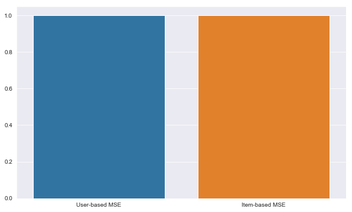

### Introduction 
This is the main code for our Collaborative Filtering approach. Herein we implement both playlist-based and song-based collaborative filtering through the creation of similarity matrices and compare results from the two approaches. Particular thanks to [Ethan Rosenthal](https://www.ethanrosenthal.com/#) for his blog posts on Collaborative Filtering.  

We start by importing the relevant libraries and reading in the data. 


```python
# import relevant libraries  
import numpy as np
import pandas as pd
import matplotlib.pyplot as plt
import pickle
from sklearn.metrics import mean_squared_error
import seaborn as sns
```


```python
# read in the data 
# data retrieval methods present in data_retrieval.ipynb 

# tracks_in_playlists is a dict wherein each key is a playlist id
# and each value is a list of song id's corresponding to songs 
# contained in that playlist  
a = open("tracks_in_playlists2.p",'rb')
tracks_in_playlists = pickle.load(a)

# playlist_data is a dict wherein each key is a playlist id
# and each value is a list of playlist attributes
a = open("playlist_data2.p", 'rb')
playlist_data = pickle.load(a)
```

### Generating  quality scores for playlists   
Besides similarity scores, we wanted to weigh each playlist in our model according to a custom-generated 'quality' metric. The motivation behind the quality score stemmed from a desire to account for playlists which have a high follower count not as a result of a plurality of good songs but rather by having fewer really popular songs in them. Thus, we divided regularized the number of followers by the mean popularity of the songs contained in the playlist to generate the quality metric. 


```python
# generate quality scores for each playlist   
playlist_quality = dict()
for playlist in playlist_data:
    pop_mean = playlist_data[playlist]["popularity"]
    num_followers = playlist_data[playlist]["num_followers"]
    playlist_quality[playlist] = np.log(num_followers) / pop_mean
```


```python
playlist_quality = np.asarray(list(playlist_quality.values()))
```


```python
# quick sanity check 
len(playlist_quality)
```


    17


```python
# ensuring the two datasets match 
for playlist in list(tracks_in_playlists):
    if playlist not in playlist_data:
        del(tracks_in_playlists[playlist])
print(len(tracks_in_playlists))
```

    17
    


```python
# regularizing playlist quality values 
min_score = np.min(playlist_quality)
max_score = np.max(playlist_quality)
playlist_quality = (playlist_quality-min_score)/(max_score-min_score)
```


```python
num_small = 0
for i in playlist_quality:
    if i < 0.1:
        num_small += 1
print(num_small)
```

    2
    


```python
tracks_in_playlists
all_songs = {}
all_playlists = {}

# for each playlist
for playlist in tracks_in_playlists:
    # for each song in that playlist 
    for song in tracks_in_playlists[playlist]:
        # mark that song present 
        all_songs[song] = 1
    # mark that playlist present 
    all_playlists[playlist] = 1
```


```python
all_songs = list(all_songs)
all_playlists =  list(all_playlists)
num_songs = len(all_songs)
num_playlists = len(all_playlists)

print('In our dataset, we have {0} songs over {1} playlists'.format(num_songs, num_playlists))
```

    In our dataset, we have 1196 songs over 17 playlists
    

### Generating main dataframe 
We generate a dataframe named `inclusion_df` wherein each row corresponds to a playlist, each column corresponds to a song and a value of `1.0` represents that the song (column-value) is present in that playlist (row-value)  


```python
inclusion_df = pd.DataFrame(np.zeros((num_playlists, num_songs)), index = all_playlists, columns = all_songs)
```


```python
# populate the dataframe 
for playlist in tracks_in_playlists:
    for song in tracks_in_playlists[playlist]:
        inclusion_df[song][playlist] = 1
```


```python
inclusion_df.head()
```


<div>
<style scoped>
    .dataframe tbody tr th:only-of-type {
        vertical-align: middle;
    }

    .dataframe tbody tr th {
        vertical-align: top;
    }

    .dataframe thead th {
        text-align: right;
    }
</style>
<table border="1" class="dataframe">
  <thead>
    <tr style="text-align: right;">
      <th></th>
      <th>spotify:track:2kFCIJNlWbVawo6uMboWqt</th>
      <th>spotify:track:4SyZQvdTugBcuSOJjCjUaQ</th>
      <th>spotify:track:1iJ3232UUZEcP8LpPI8vFN</th>
      <th>spotify:track:5BSevvj5fcgXr7HPboNaRL</th>
      <th>spotify:track:14gEDPQtsTcbZOWs7EXg4V</th>
      <th>spotify:track:452sBm5br5I3n8U9N1tq08</th>
      <th>spotify:track:0xlg27g9OXI2PHvwLJSCoo</th>
      <th>spotify:track:6PprkICqzvUdCYS7wv1iDh</th>
      <th>spotify:track:7qLjSwg4SwfXGzWPp1HV9F</th>
      <th>spotify:track:40wbxg77nK3ouaHTgH0AEe</th>
      <th>...</th>
      <th>spotify:track:6Gj8t64aE4vrdmR7M7pH1o</th>
      <th>spotify:track:55TD8m3JOy4xx6qaSKc4uz</th>
      <th>spotify:track:44NKXFiTqU8Gj5wani079c</th>
      <th>spotify:track:7ANmgFJ8YDBh0uUOfSeYrX</th>
      <th>spotify:track:5GXAXm5YOmYT0kL5jHvYBt</th>
      <th>spotify:track:0g6mKqhGtUIEoLSmV8ozi8</th>
      <th>spotify:track:0gnS1k4dyGPuD3TtHFaCD8</th>
      <th>spotify:track:19hM5qpD5U5jLmNh4dg77m</th>
      <th>spotify:track:4ObrzaK2VVwvy9nd2Y2M6D</th>
      <th>spotify:track:36UOYu9pMCANOKoJPSHqal</th>
    </tr>
  </thead>
  <tbody>
    <tr>
      <th>101121</th>
      <td>0.0</td>
      <td>0.0</td>
      <td>0.0</td>
      <td>0.0</td>
      <td>0.0</td>
      <td>0.0</td>
      <td>0.0</td>
      <td>0.0</td>
      <td>0.0</td>
      <td>0.0</td>
      <td>...</td>
      <td>0.0</td>
      <td>0.0</td>
      <td>0.0</td>
      <td>0.0</td>
      <td>0.0</td>
      <td>0.0</td>
      <td>0.0</td>
      <td>0.0</td>
      <td>0.0</td>
      <td>0.0</td>
    </tr>
    <tr>
      <th>720740</th>
      <td>0.0</td>
      <td>0.0</td>
      <td>0.0</td>
      <td>0.0</td>
      <td>0.0</td>
      <td>0.0</td>
      <td>1.0</td>
      <td>0.0</td>
      <td>0.0</td>
      <td>0.0</td>
      <td>...</td>
      <td>0.0</td>
      <td>0.0</td>
      <td>0.0</td>
      <td>0.0</td>
      <td>0.0</td>
      <td>0.0</td>
      <td>0.0</td>
      <td>0.0</td>
      <td>0.0</td>
      <td>0.0</td>
    </tr>
    <tr>
      <th>159077</th>
      <td>0.0</td>
      <td>0.0</td>
      <td>0.0</td>
      <td>0.0</td>
      <td>0.0</td>
      <td>0.0</td>
      <td>0.0</td>
      <td>0.0</td>
      <td>0.0</td>
      <td>0.0</td>
      <td>...</td>
      <td>0.0</td>
      <td>0.0</td>
      <td>0.0</td>
      <td>0.0</td>
      <td>0.0</td>
      <td>0.0</td>
      <td>1.0</td>
      <td>0.0</td>
      <td>0.0</td>
      <td>0.0</td>
    </tr>
    <tr>
      <th>547873</th>
      <td>0.0</td>
      <td>0.0</td>
      <td>0.0</td>
      <td>0.0</td>
      <td>0.0</td>
      <td>0.0</td>
      <td>0.0</td>
      <td>0.0</td>
      <td>0.0</td>
      <td>0.0</td>
      <td>...</td>
      <td>0.0</td>
      <td>0.0</td>
      <td>0.0</td>
      <td>0.0</td>
      <td>0.0</td>
      <td>0.0</td>
      <td>0.0</td>
      <td>0.0</td>
      <td>0.0</td>
      <td>0.0</td>
    </tr>
    <tr>
      <th>25495</th>
      <td>0.0</td>
      <td>0.0</td>
      <td>0.0</td>
      <td>0.0</td>
      <td>0.0</td>
      <td>0.0</td>
      <td>0.0</td>
      <td>0.0</td>
      <td>1.0</td>
      <td>0.0</td>
      <td>...</td>
      <td>0.0</td>
      <td>0.0</td>
      <td>0.0</td>
      <td>0.0</td>
      <td>0.0</td>
      <td>1.0</td>
      <td>0.0</td>
      <td>0.0</td>
      <td>0.0</td>
      <td>0.0</td>
    </tr>
  </tbody>
</table>
<p>5 rows × 1196 columns</p>
</div>


```python
inclusion_df.shape
```


    (17, 1196)


#### Calculating the sparsity of playlist-song matrix 


```python
sparsity = float(len(np.asarray(inclusion_df).nonzero()[0]))
sparsity /= (inclusion_df.shape[0] * inclusion_df.shape[1])
sparsity *= 100
print('Sparsity: {:4.2f}%'.format(sparsity))
```

    Sparsity: 5.97%
    

So, only 5.97% of the entries in our dataframe have values, which is a fairly low number and might pose problems for the model later on. 


```python
def xrange(x):
    return iter(range(x))
```

#### Generating train and test data
Split the data into testing and train sets. To generate the test sets, we remove a random 10% of songs from each playlist (and ensure that the train and test sets are completely disjoint)  


```python
def train_test_split(inclusions):
    test = np.zeros(inclusions.shape)
    train = inclusions.copy()
    for user in xrange(inclusions.shape[0]):
        nonzero = inclusions[user, :].nonzero()[0]
        size = int(.1 * len(nonzero))
        test_inclusions = np.random.choice(inclusions[user, :].nonzero()[0], 
                                        size=size, 
                                        replace=False)
        train[user, test_inclusions] = 0.
        test[user, test_inclusions] = inclusions[user, test_inclusions]
        
    # Test and training are truly disjoint
    assert(np.all((train * test) == 0)) 
    return train, test
```


```python
train, test = train_test_split(np.asarray(inclusion_df))
```

#### Generating similarity matrices


```python
def fast_similarity(inclusions, kind='user', epsilon=1e-9):
    # epsilon -> small number for handling dived-by-zero errors
    if kind == 'user':
        sim = inclusions.dot(inclusions.T) + epsilon
    elif kind == 'item':
        sim = inclusions.T.dot(inclusions) + epsilon
    norms = np.array([np.sqrt(np.diagonal(sim))])
    return (sim / norms / norms.T)
```


```python
user_similarity = fast_similarity(train, kind='user')
item_similarity = fast_similarity(train, kind='item')
```

#### Generating predictions


```python
def predict_fast_simple(data, similarity, weights, kind='user'): 
    if kind == 'user':
        for i, row in enumerate(similarity):
            similarity[i] = row * weights       
        my_matrix = similarity.dot(data) / np.array([np.abs(similarity).sum(axis=1)]).T
        for i, row in enumerate(my_matrix):
            max_val = np.max(row)
            min_val = np.min(row)
            my_matrix[i] = (row - min_val)/(max_val - min_val)
    elif kind == 'item': 
        my_matrix = data.dot(similarity) / np.array([np.abs(similarity).sum(axis=1)])
        for i, row in enumerate(my_matrix):
            max_val = np.max(row)
            min_val = np.min(row)
            my_matrix[i] = (row - min_val)/(max_val - min_val)        
    return my_matrix
```


```python
def predict_fast_simple_single_playlist(data, similarity, weights, epsilon = 0.001):
    #This is the model that will do the song selection for a single playlist; our final model
    n = len(similarity)
    for i in range(n):
        similarity[i] = similarity[i]*weights[i]
    #Want to make the calculation fast, so we will drop every index where the similarity is very small. 
    # This will allow this part to run quickly regardless of how many playlists we end up getting
    num_deletions = 0
    for i in range(n):
        if similarity[i-num_deletions] < epsilon:
            del(similarity[i-num_deletions])
            del(data[i-num_deletions])
            num_deletions += 1
    print(data, similarity)
    data = np.asarray(data)
    similarity = np.asarray(similarity)
    return similarity.dot(data)/np.abs(similarity).sum(axis = 1)
```


```python
first_train_data = list(train[0])
first_similarity = list(user_similarity[0])
```


```python
user_prediction = predict_fast_simple(train, user_similarity, playlist_quality, kind='user')
```


```python
item_prediction = predict_fast_simple(train, item_similarity, playlist_quality, kind='item')
```

#### Comparing MSE from the two approaches


```python
def get_mse(pred, actual):
    # Ignore nonzero terms.
    pred = pred[actual.nonzero()].flatten()
    actual = actual[actual.nonzero()].flatten()
    return mean_squared_error(pred, actual)
```


```python
user_MSE = get_mse(user_prediction, test)
item_MSE = get_mse(item_prediction, test)
print(str('User-based CF MSE: ') + str(user_MSE))
print(str('Item-based CF MSE: ') + str(item_MSE))
```

    User-based CF MSE: 0.9992859046649107
    Item-based CF MSE: 0.9983065279920121
    


```python
with sns.axes_style('darkgrid'):
    plt.figure(figsize=(10,6))
    sns.barplot(x=['User-based MSE', 'Item-based MSE'], y=[user_MSE, item_MSE])
```




